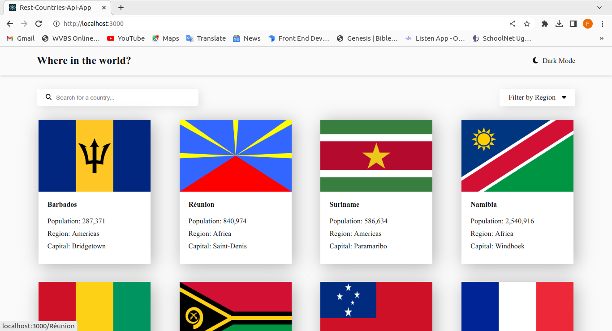
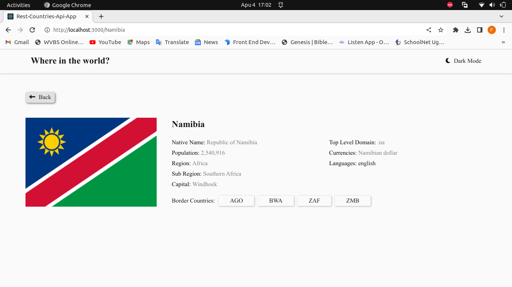
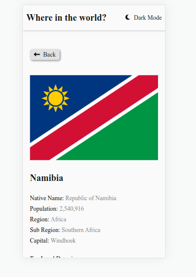

# Frontend Mentor - REST Countries API with color theme switcher solution

This is a solution to the [REST Countries API with color theme switcher challenge on Frontend Mentor](https://www.frontendmentor.io/challenges/rest-countries-api-with-color-theme-switcher-5cacc469fec04111f7b848ca). Frontend Mentor challenges help you improve your coding skills by building realistic projects.

## Table of contents

- [Overview](#overview)
  - [The challenge](#the-challenge)
  - [Screenshot](#screenshot)
  - [Links](#links)
- [My process](#my-process)
  - [Built with](#built-with)
  - [What I learned](#what-i-learned)
  - [Continued development](#continued-development)
- [Author](#author)

## Overview

### The challenge

Users should be able to:

- See all countries from the API on the homepage
- Search for a country using an `input` field
- Filter countries by region
- Click on a country to see more detailed information on a separate page
- Click through to the border countries on the detail page
- Toggle the color scheme between light and dark mode _(optional)_

### Screenshot





### Links

- Solution URL: [https://github.com/FredZabu/rest-countries-api-app.git]
- Live Site URL: [https://rest-countries-api-6h9brsotc-fredzabu.vercel.app/]

## My process

### Built with

- Semantic HTML5 markup
- CSS custom properties
- Flexbox
- CSS Grid
- desktop-first workflow
- [React]

### What I learned

I learnt how to use react hooks like useState and useEffect hook.
I also learnt how to change an object in an array.

```html
<p>
  <span className="inf1">Currencies: </span>
  <span>{(Object.values(dataNeeded[0].currencies))[0].name}</span>
</p>
```

```js
useEffect(() => {
  const getData = async () => {
    try {
      const res = await fetch(
        `https://restcountries.com/v3.1/name/${searchName}`
      );
      if (!res.ok) throw new Error("something went wrong");
      const data = await res.json();
      setDataNeeded(data);
      console.log(Object.values(data[0].currencies));
    } catch (error) {
      console.log("error here " + error);
    }
  };
  getData();
}, [countryName, searchName]);
```

### Continued development

State management in react.
Testing in react.
other React hooks.

## Author

- Frontend Mentor - [Fred Zabulon](https://www.frontendmentor.io/profile/fredzabu)
- Twitter - [@FredZabulon](https://twitter.com/FredZabulon)
